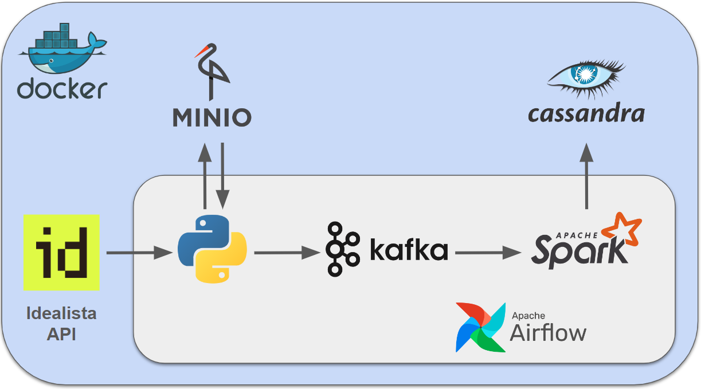

# Idealista API Data structured streaming with Kafka and Spark
## Description
This project demonstrates a real-time data processing pipeline using Docker, Airflow, minio, Kafka, Spark, and Cassandra. The pipeline extracts real estate listings from the Idealista API, simulates data streaming into Kafka, processes the data using Spark, and stores the results in Cassandra. Startup execution of Kafka and Spark are orchestrated with airflow and are **completely automated**. (Not implemented yet) Spark job is programmatically terminated after a certain inactivity time.

## Architecture


## Prerequisites
- An API key and secret for Idealista API
- Docker
- Docker Compose
- Apache Airflow (version apache/airflow:2.9.0)
- Apache Kafka (version confluentinc/cp-kafka:7.4.4)
- Apache Spark (version bitnami/spark:3.5.0)
- Apache Cassandra (version bitnami/cassandra:latest)
- Python (version 3.12.2 used)

## Setup and Installation

### Get Idealista API access
You can request access to Idealista API [here](https://developers.idealista.com/access-request). In one-two weeks you should get an answer from Idealista with Apikey and Secret.
Save them in `api_access.txt` It will be used as a secret in docker-compose. [Docker secrets](https://docs.docker.com/engine/swarm/secrets/) are a handy and secured way of handling sensitive information inside containers.

### Cloning the Repository. Setup Environment Variables
Clone the repository and place `api_access.txt` into it. All environment variables are defined in `.env` file, so no furhter definition needed.

### Building and Running the Containers
It is assumed that docker is installed on your system. Navigate to the cloned repository and execute
```bash
docker-compose up --build
```

### Start main DAG
Go to Airflow UI (by default http://localhost:8080) and start 'idealista_pipeline' DAG.

## TODO
 - Use OOP (spark). Restructure code to use classes instead of functions.
 - Save filenames of processed data only after the data was sent.
 - Use better way to store data, other than local_file_system-to-minio setup.
 - Tests
